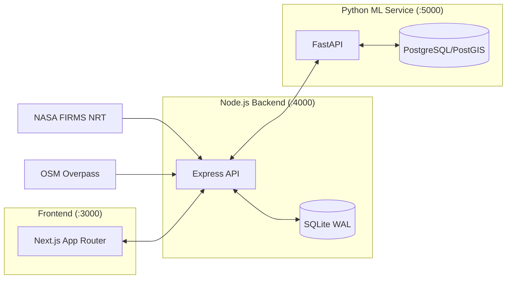

<div align="center">
  
  <h1 align="center">PyroSense</h1>
  <p align="center">
    <strong>Next-Generation Industrial Thermal Intelligence & Risk Orchestration</strong>
  </p>
</div>

---

## 🛰️ Overview

**PyroSense** is an advanced geospatial intelligence platform that intercepts raw satellite thermal telemetry and transforms it into explainable, risk-ranked insights for industrial infrastructure. 

---

## 🛠️ Tech Stack

| Technology | Why it was chosen |
|---|---|
| **Next.js 14 (App Router)** | Client-side fetching via SWR with HTTP caching over a pure frontend architecture (no API keys in client). |
| **Node.js / Express** | Robust backend to orchestrate external APIs (FIRMS, Overpass, OpenRouter) and proxy ML endpoints. |
| **better-sqlite3 (WAL mode)** | Ultra-fast local database chosen for its millisecond reads, perfect for the current scope of minimal persistence needs. |
| **FastAPI** | High-performance Python backend serving the ML inference pipelines, feature engineering, and OpenRouter GenAI caching. |
| **PostgreSQL / PostGIS** | Relational data persistence for ML predictions, risk timelines, and spatial querying. |
| **react-leaflet + supercluster** | Swapped out unmaintained clustering libraries for KD-tree based `supercluster`, enabling a 10x performance rewrite to render 50k+ points efficiently. |
| **OpenRouter / LLMs** | Generates grounded summaries (temp 0) using structured facts directly from the backend to completely eliminate hallucinations. |

---

## 🤖 Models Used

| Model | Purpose | Input Features | Key Metrics |
|---|---|---|---|
| **Gradient Boosting Classifier (old)** | Predicts contextual hotspot categories (4 classes). | 36 features | No verified accuracy or F1 metrics documented in the repository. |
| **MLP Classifier (new)** | Predicts contextual hotspot categories (5 classes). | 43 features | Training samples: NOT YET PROVIDED, Random-split accuracy: NOT YET PROVIDED. |
| **1/3/7-Day GRU Risk Models** | Predicts wildfire risk at 1-day, 3-day, and 7-day horizons over H3 resolution-7 cells. | 30 days × 17 features per day | Test accuracy, ROC-AUC, PR-AUC: NOT YET PROVIDED. |

---

## 🏗️ Architecture at a Glance



- **Frontend (`/frontend`)**: Next.js 14 pure client, fetching precomputed results via SWR.
- **Node Backend (`/backend`)**: Orchestration, geospatial compute, GenAI facts compilation, and SQLite storage for facilities & detections.
- **FastAPI ML Service (`/pyrosense_ml`)**: Feature engineering, classification inference (GBM/MLP), risk prediction (GRU), and PostGIS prediction storage.

---

## 🚀 Quickstart

### Prerequisites
- Node.js v18+ & npm v9+
- A NASA FIRMS Map Key ([Get one here](https://firms.modaps.eosdis.nasa.gov/api/map_key/))
- Python 3.12+ with [uv](https://docs.astral.sh/uv/) and Docker (for PostgreSQL/PostGIS)
- *(Optional)* OpenRouter API Key for the GenAI Assistant

### 1. Backend Initialization
```bash
cd backend
npm install
cp .env.example .env
npm run ingest:facilities
npm run ingest:firms
npm run dev
```

### 2. ML Service Initialization
```bash
cd pyrosense_ml
docker run -d --name pyrosense-ml-postgis \
  -e POSTGRES_USER=pyrosense -e POSTGRES_PASSWORD=pyrosense -e POSTGRES_DB=pyrosense_ml \
  -p 5433:5432 postgis/postgis:16-3.4
cp .env.example .env
uv run python -m app.main
```

### 3. Frontend Initialization
```bash
cd frontend
npm install
cp .env.example .env
npm run dev
```
Access the **Command Dashboard** at `http://localhost:3000`.

---

## ⚠️ Good to know before you dig in

- **Contextual, not causal labels:** The hotspot classifier infers type from proximity and history; it does not provide independent ground-truth ignition causes.
- **Risk thresholds, not probabilities:** Risk signals are rule-based derivations from fixed thresholds (e.g. 1-day 0.65), not calibrated percentage chances of fire.
- **The Unknown path is mandatory:** Low confidence classifications (`< 0.40`) force a "Needs Review" state rather than an incorrect guess.
- **The 7-day model is a weak signal:** Validation metrics for the 7-day risk model were weak; it should be treated as a long-range signal only.
- **Weather and spatial gaps:** Training data is limited in spatial coverage, and live weather inputs use safe approximations or degraded priors when external services fail.

---

📖 **Want to go deeper — full architecture, the reasoning behind every major decision, and honest answers to the hard questions?**
➡️ **[Explore the docs](docs/index.md)**

---

## 📝 License / Credits

License: MIT — see [LICENSE](LICENSE)
