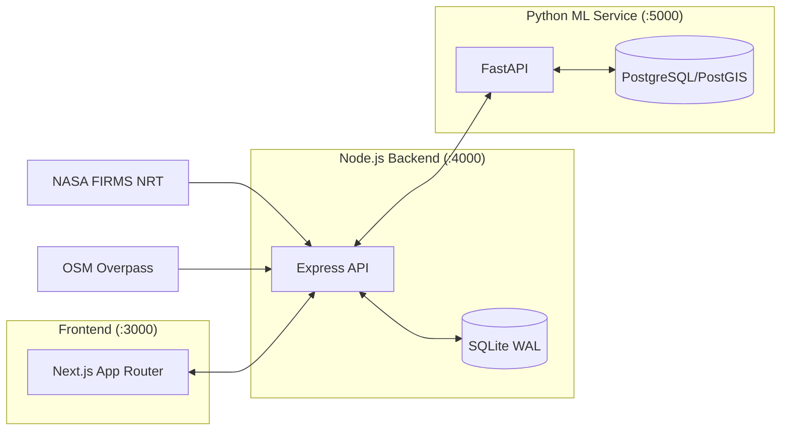

<div align="center">
  
  <h1 align="center">PyroSense</h1>
  <p align="center">
    <strong>Next-Generation Industrial Thermal Intelligence & Risk Orchestration</strong>
  </p>
  <p align="center">
    <a href="docs/README.md">Deep-Dive Documentation</a>
  </p>
</div>

---

## 🛰️ Overview

**PyroSense** is an advanced geospatial intelligence platform that intercepts raw satellite thermal telemetry and transforms it into explainable, risk-ranked insights for industrial infrastructure. 

For the complete deep-dive on architecture, ML pipelines, and API references, start here:
**➡ [Read the full documentation (docs/README.md)](docs/README.md)**

---

## ✨ Feature List

- **Geospatial Correlation Engine:** Binds NASA FIRMS (VIIRS & MODIS) hotspots to industrial assets using OSM Overpass polygons and point-in-polygon ray-casting.
- **Thermal Fingerprinting (Baselining):** Computes a rolling, multi-dimensional baseline (FRP, spatial signatures, directional zone activity) to track what "normal" looks like.
- **"What Changed" Analysis:** Generates programmatic signals when live data deviates from a facility's fingerprint (e.g. spatial spread expansion or frequency spikes).
- **Grounded Generative AI Assistant:** Provides stateless Chatbot narratives (via OpenRouter) strictly grounded in computed facts, completely eliminating hallucinations.
- **Multi-Dimensional Risk Scoring:** Scores assets dynamically (0–100) using inverse facility health, classification severity, FRP deviation, and temporal trends.
- **Hotspot Classification:** Contextual tagging using a 5-class Gradient Boosting / MLP classifier, augmented with land cover and weather data.
- **1/3/7-Day Risk Horizons:** Predicts future wildfire risk using GRU models over a 30-day feature history.
- **High-Performance Map Rendering:** Displays thousands of FIRMS points alongside facility polygons seamlessly using `useSupercluster` KD-tree clustering.

---

## 🏗️ Architecture at a Glance



- **Frontend (`/frontend`)**: Next.js 14 pure client, fetching precomputed results via SWR.
- **Node Backend (`/backend`)**: Orchestration, geospatial compute, GenAI facts compilation, and SQLite storage for facilities & detections.
- **FastAPI ML Service (`/pyrosense_ml`)**: Feature engineering, classification inference (GBM/MLP), risk prediction (GRU), and PostGIS prediction storage.

---

## 🛠️ Tech Stack

| Technology | Why it was chosen |
|---|---|
| **Next.js 14 (App Router)** | Client-side fetching via SWR with HTTP caching over a pure frontend architecture (no API keys in client). |
| **Node.js / Express** | Robust backend to orchestrate external APIs (FIRMS, Overpass, OpenRouter) and proxy ML endpoints. |
| **better-sqlite3 (WAL mode)** | Ultra-fast local database chosen for its millisecond reads, perfect for the current scope of minimal persistence needs. |
| **FastAPI** | High-performance Python backend serving the ML inference pipelines, feature engineering, and OpenRouter GenAI caching. |
| **PostgreSQL / PostGIS** | Relational data persistence for ML predictions, risk timelines, and spatial querying. |
| **react-leaflet + supercluster** | Swapped out unmaintained clustering libraries for KD-tree based `supercluster`, enabling a 10x performance rewrite to render 50k+ points efficiently. |
| **scikit-learn / joblib / Keras** | Drives the 36-feature GBM classifier, MLP classifier, and GRU risk horizons. |
| **OpenRouter / LLMs** | Generates grounded summaries (temp 0) using structured facts directly from the backend, failing over to deterministic templates. |

---

## 🚀 Quickstart

### Prerequisites
- Node.js v18+ & npm v9+
- A NASA FIRMS Map Key ([Get one here](https://firms.modaps.eosdis.nasa.gov/api/map_key/))
- Python 3.12+ with [uv](https://docs.astral.sh/uv/) and Docker (for PostgreSQL/PostGIS)
- *(Optional)* OpenRouter API Key for the GenAI Assistant

### 1. Backend Initialization
```bash
cd backend
npm install
cp .env.example .env
npm run ingest:facilities
npm run ingest:firms
npm run dev
```

### 2. ML Service Initialization
```bash
cd pyrosense_ml
docker run -d --name pyrosense-ml-postgis \
  -e POSTGRES_USER=pyrosense -e POSTGRES_PASSWORD=pyrosense -e POSTGRES_DB=pyrosense_ml \
  -p 5433:5432 postgis/postgis:16-3.4
cp .env.example .env
uv run python -m app.main
```

### 3. Frontend Initialization
```bash
cd frontend
npm install
cp .env.example .env
npm run dev
```
Access the **Command Dashboard** at `http://localhost:3000`.

---

## ⚠️ Known Limitations

- **Classification labels are contextual, not causal:** The hotspot classifier infers type from OSM proximity, land cover, and fire history. It does not provide independent ground-truth ignition causes.
- **Risk levels are decision thresholds:** Risk signals are rule-based derivations from fixed thresholds, not calibrated probabilities.
- **Weather and spatial coverage gaps:** Training data represents a limited number of H3 cells, and live weather inputs use safe approximations or degraded priors when external services fail.

For the full list, read the [Known Limitations & Possible Improvements](docs/LIMITATIONS_AND_IMPROVEMENTS.md).

---

## 📝 License / Credits

License: MIT — see [LICENSE](LICENSE)
