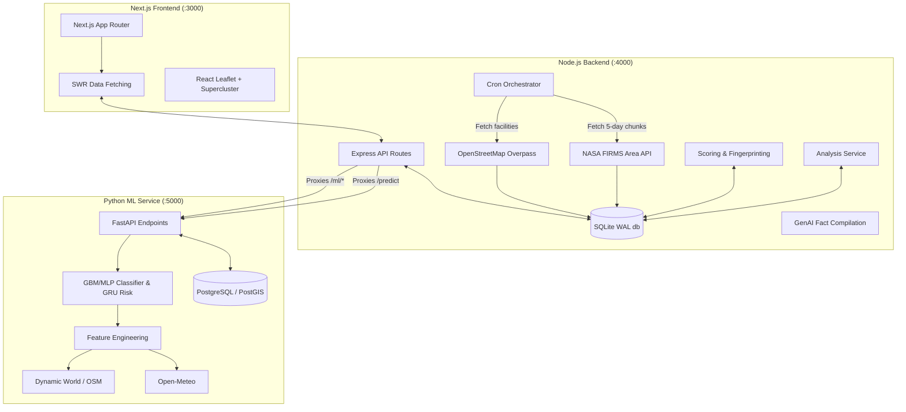

# System Architecture

PyroSense operates on a decoupled, high-performance monorepo architecture designed for real-time observability.

## Full System Diagram

## Service Responsibilities

### 1. Node.js Backend (`/backend`)
A standalone Node.js service using Express and TypeScript. It acts as the core orchestrator and data ingestor for the system.
- **FIRMS Ingestion:** A cron job pulls 1-5 days of active VIIRS/MODIS hotspots, caching a rolling 10-day window.
- **Geospatial Binding:** Matches incoming detections to industrial facilities (retrieved via OSM Overpass) using point-in-polygon logic.
- **Fingerprinting & Analysis:** Computes baselines (e.g., rolling multi-dimensional history, FRP variance) and builds "What Changed" diffs.
- **GenAI Explanations:** Extracts facts from the SQLite DB and builds a grounded prompt to forward to OpenRouter, using strict validation and a template fallback.
- **API Proxy:** Routes all frontend ML calls (`/api/predict`, `/api/ml/*`, `/api/v1/*`) to the Python ML service.

### 2. Python ML Service (`/pyrosense_ml`)
A FastAPI service containing the frozen classification and prediction pipelines.
- **Classification Inference:** Runs payloads through a Gradient Boosting (old) or MLP (new) classifier over an engineered 36-to-43 feature schema.
- **Risk Scoring:** Computes risk using GRU time-series models for 1-day, 3-day, and 7-day horizons.
- **Feature Engineering:** Pulls weather from Open-Meteo, land cover derived from OSM, and surrounding proximity features.
- **GenAI Template/Cache:** Caches explanation results in Postgres or falls back to template logic on OpenRouter failure.

### 3. Next.js Frontend (`/frontend`)
A pure Next.js 14 client (App Router). It holds no external API keys and does no heavy computation.
- **Data Fetching:** Relies strictly on SWR to pull precomputed results from the Node.js backend.
- **Map Visualization:** Implements edge-to-edge geospatial mapping using React Leaflet and `useSupercluster` (KD-tree clustering for 10x rendering performance).
- **Two-Pane Layout:** Employs a persistent detail drawer (`DetailDrawer`) mapping mutually-exclusive cell, facility, and hotspot selection states.

## Databases

- **SQLite (WAL mode) in Node.js:** Used for storing facility geometries and FIRMS detections. **Why SQLite?** The backend's storage needs are minimal and primarily read-heavy over small bounding boxes. `better-sqlite3` in WAL mode provides millisecond reads. There was no need for a massive external database, maintaining simplicity.
- **PostgreSQL / PostGIS in FastAPI:** Used for predictions, risk timelines, ML model inferences, and AI explanation caching. **Why Postgres?** The ML side requires persistence across restarts for predictions, spatial querying on historical hotspots, and timeline tracking that exceeds the backend's rolling 10-day window.
